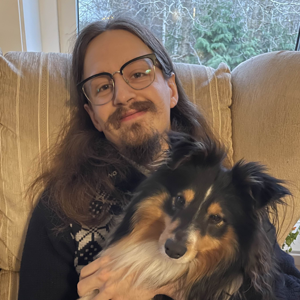

# CV: David "Sid" Olofsson 

### Competencies:

#### Expert:

- Linux
- Docker
- Rust

#### Senior:

- Infrastructure as Code (Terraform)
- API design and versioning
- CLI design
- Kubernetes with SELinux
- Python
- C/C++
- Network administration
- Bookkeeping

### Personal Projects of note:

They have given me significant experience and showcase my drive to understand
and improve.

#### `hired` / `add-ed`:

An imitation of the early text-editor `ed`, to most DOS users known as `edlin`,
written in Rust. It adds syntax-highlighting, changes the default selection
after commands and makes the command prompt and editing mode slightly more user
friendly.

#### `bookkeep-web`:

A simple OpenID connect authenticated server side rendered bookkeeping website
written in Rust without a web framework. Instead it uses `hyper` and defines a
function to call on every request, which in turn performs all the routing by
switch-case and calling into other functions. More of an experiment fixture
than a finished project for now, but I have hope it will be done and my method
of bookkeeping in a year or so.

### Professional history:

(most recent first)

#### CI/CD Engineer:
*October 2024 to December 2024 at Volvo Cars via Nexer*

I joined a core CI team within Volvo Cars in operations, maintenance and
migration of their python scripts to a new CI platform.

In my short time in the team I quickly got a grasp of the CI flow and core
codebase, enabling me to make significant contributions and help establish new
conventions within the codebase aimed to simplify usage and maintenance.

#### HIL DevOps Engineer:
*January 2023 - October 2024 at Volvo Cars via Nexer*

I worked as the most quality oriented in the team, focusing my time on
documentation, refactoring and maintainability improvements.

As part of this I build a highly flexible Domain Specific Language for
firmware readout and flashing, refactored several Ansible playbooks and
rewrote the most complex part of a legacy Python CLI application while
maintaining backwards compability.

All of this on top of the teams core work of HIL operations, user support
and feature development of a cross organizational CI/CD system with
extensive HIL testing.

#### Cloud Native Developer:
*February 2021 to November 2022 at Combitech*

I was the main Operations guy in our team, as well as Linux expert, writing and
maintaining the deployment scripts and documentation in addition to handling
everything relating to the underlying Linux VMs.

Since I got to experience starting fresh in that project I got to learn a lot of
both what works well when starting out and when more structured development
processes begin to be needed.

#### Software Developer\*:
*June 2019 to February 2021 at Lecip Arcontia*

Since I had a great breadth of competence in a small company I ended up doing a
bit of everything as needed. Rather than only software development I also
performed network administration tasks and acted as tech-support for other
employees.

Most notably:
- I created a test harness and script to validate that the software abstractions
  interacted correctly with the hardware. This ended up revealing a production
  issue that I physically traced to an improperly rotated component.
- I rewrote a product presentation and binary download website that restricts
  downloads of binaries to customers who owned a device that needed it. The
  site included proper authentication and authorization, as well as an
  administration UI to add/update/delete products/binaries/users/permissions.
  It is still up at <https://dev.arcontia.se>.
