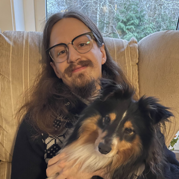

# CV: David "Sid" Olofsson 

### Competencies:

#### Expert:

- Linux
- Docker
- Rust

#### Senior:

- Infrastructure as Code (Terraform)
- API design and versioning
- CLI design
- Kubernetes with SELinux
- Python
- C/C++
- Network administration
- Bookkeeping

### Personal Projects of note:

They have given me significant experience and showcase my drive to understand
and improve.

#### `hired` / `add-ed`:

An imitation of the early text-editor `ed`, to most DOS users known as `edlin`,
written in Rust. It adds syntax-highlighting, changes the default selection
after commands and makes the command prompt and editing mode slightly more user
friendly.

#### `bookkeep-web`:

A simple OpenID connect authenticated server side rendered bookkeeping website
written in Rust without a web framework. Instead it uses `hyper` and defines a
function to call on every request, which in turn performs all the routing by
switch-case and calling into other functions. More of an experiment fixture
than a finished project for now, but I have hope it will be done and my method
of bookkeeping in a year or so.

#### `sidserver`:

Simply said, I've been self-hosting since 2014. Notable steps in that journey:

- 2014, started out with a basic Ubuntu with LAMP stack directly installed to
  run OwnCloud.
- 2016, switched to FreeNAS and ZFS (with Jails used to isolate
  applications, the BSD option for containerization).
- 2017, switched to Arch Linux and BtrFS (with docker compose).
- 2018, replaced my pfSense router with the server (nftables).

### Professional history:

(most recent first)

#### Software Traceability Architect:
*January 2025 to present time at Volvo Cars via Nexer*

I was moved to a team focused on creating a platform to validate structure and
references in the VCC software traceability, which is legally required for all
software in a car and integrated into the CI flows.

While the backend and frontend binaries were being developed by my teammates I
both took active part in design discussions of those applications and took
charge of our CI and infrastructure. 4 months later we deployed our first
version without any issues, and since then we have rapidly expanded our feature
set to replace and expand on legacy solutions as the CI system's needs change.

Keywords: Terraform, GitHub Actions, Azure, Docker

#### CI/CD Engineer:
*October 2024 to December 2024 at Volvo Cars via Nexer*

I joined a core CI team within Volvo Cars in operations, maintenance and
migration of their python scripts to a new CI platform.

In my short time in the team I quickly got a grasp of the CI flow and core
codebase, enabling me to make significant contributions and help establish new
conventions within the codebase aimed to simplify usage and maintenance.

Keywords: Python, Zuul, Gerrit, GitLab, CI, Linux

#### HIL DevOps Engineer:
*January 2023 - October 2024 at Volvo Cars via Nexer*

I worked as the most quality oriented in the team, focusing my time on
documentation, refactoring and maintainability improvements.

As part of this I build a highly flexible Domain Specific Language for
firmware readout and flashing, refactored several Ansible playbooks and
rewrote the most complex part of a legacy Python CLI application while
maintaining backwards compability.

All of this on top of the teams core work of HIL operations, user support
and feature development of a cross organizational CI/CD system with
extensive HIL testing.

Keywords: Linux, Python, Docker, Ansible, Gerrit, DSL, Ansible

#### Cloud Native Developer:
*February 2021 to November 2022 at Combitech*

I was the main Operations guy in our team, as well as Linux expert, writing and
maintaining the infrastructure declaration and documentation in addition to
handling everything relating to the underlying Linux VMs. Notably the platform
was designed to be installed on a self-hosted Kubernetes cluster deployed onto
on-prem hardware, so scripting and documenting the infrastructure setup required
insight into Kubernetes internals and significant orchestration effort to make
all components work well (especially logging and metrics collection).

Since I got to experience starting fresh in that project I got to learn a lot of
both what works well when starting out and when more structured development
processes and proper documentation really begins to be needed.

Tools: Kubernetes, Helmfile, Terraform, Azure, Bash, Rancher, GitHub, Scrum,
Grafana stack

#### Software Developer\*:
*June 2019 to February 2021 at Lecip Arcontia*

Since I had a great breadth of competence in a small company I ended up doing a
bit of everything as needed. Rather than only embedded software development I
also handled web-development, network administration and SysOps tasks. This
ended up being my first more proper forays into both CI/CD and Cloud deployment
(of a minimal docker container), and rather defining for my career.

Keywords: Linux, BitBucket, Fortinet, VMWare, Docker, Google Cloud Platform

#### Bachelor in Computer Science:
*August 2016 to December 2019 at Chalmers University of Technology*
